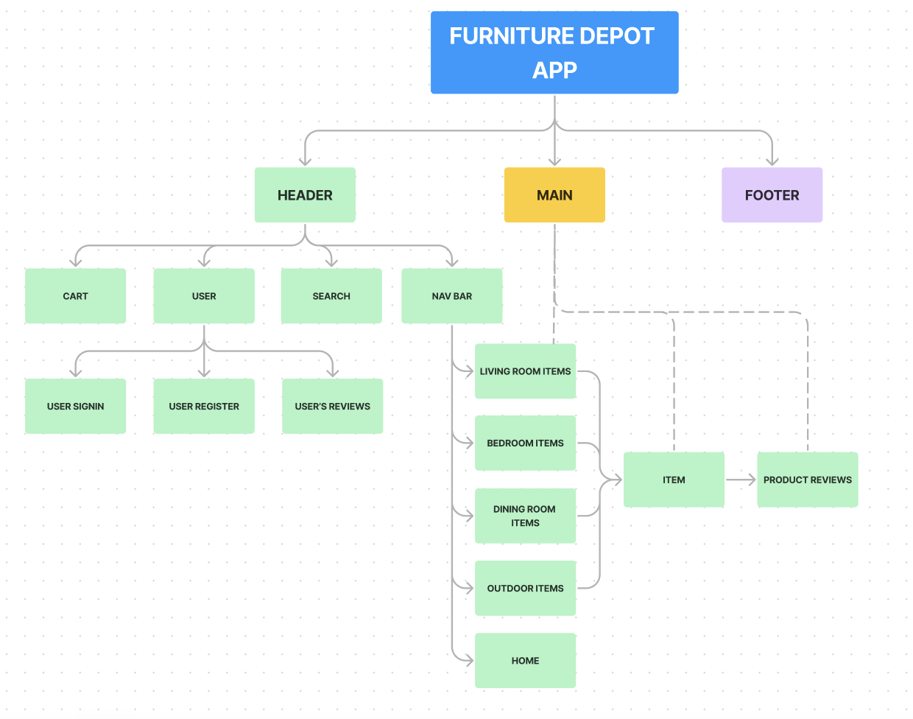
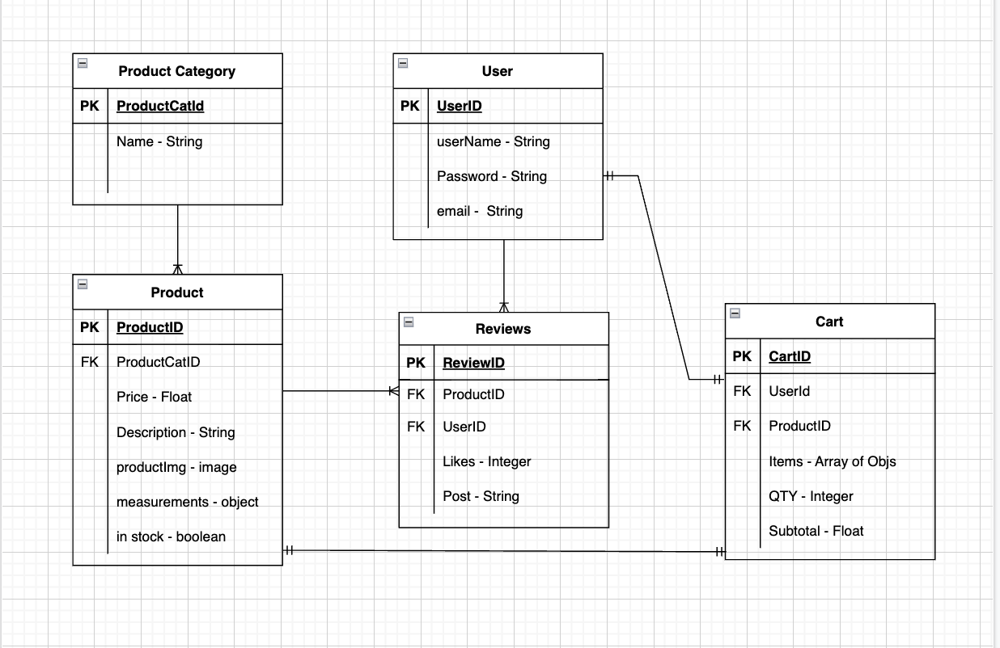
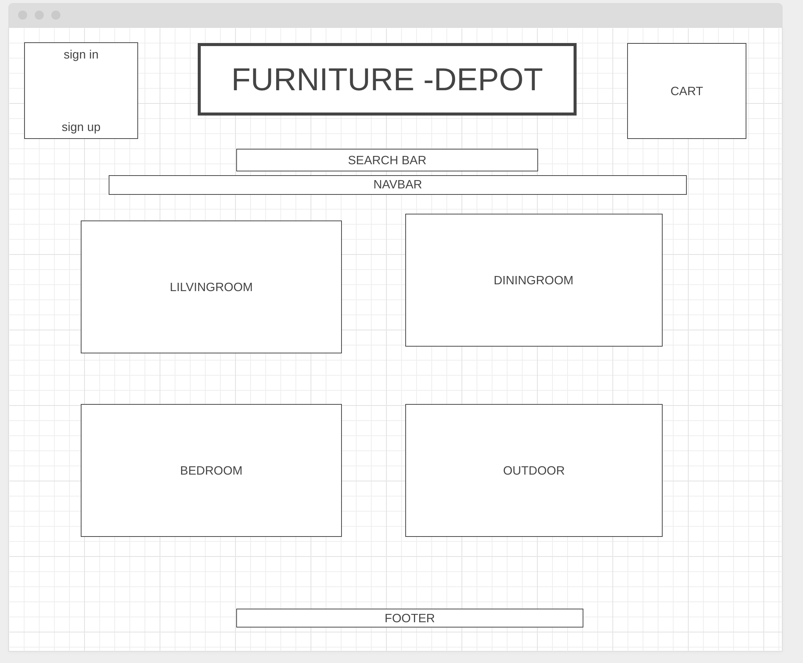

# Furniture-Depot
A Full-Stack E-Commerce App Built with the PERN Stack


## Table of Contents

1. [Overview](#overview)
2. [Preparation](#preparation)
3. [Front-End](#frontend)
4. [Back-End](#backend)
5. [Full-CRUD](#fullcrud)
6. [Development Team](#developmentteam)

## Overview <a name="overview"></a>
Furniture Depot is a new home furniture retailer and wants to create an ecommerce site. They want users to be able to visit the site to view furnishings organized by different rooms in the house. Users will be able to read product reviews associated with particular products, as well as contribute reviews of their own. Users will be able to register for an account and “purchase” items through a cart.

## Preparation <a name="preparation"></a>
#### When deciding on what we wanted to do for this project we worked together to create some basic information to follow as we moved forward.

Component Hierarchy Diagram

Entity Relationship Diagram

Initial Wireframe


## Front-End <a name="frontend"></a>
The Front end of the application was built with react. In the components folder there are separate components for each of the 4 categories. Living Room, Dining Room, Bedroom, and Outdoor. Originally there were just products visible via a function we had created in our controllers on the back end to show all of the products in any given category. Once reviews were added this became more complicated and was one of the places that we had the most trouble with, getting not only the products we wanted but the reviews associated with them via the category_id. To do this we created this bit of code 

```
const [product, setProduct] = useState([])
    useEffect(() => {
        const getData = async () => {
            const productResponse = await axios.get(`http://localhost:3001/api/products/reviews`)
                setProduct(productResponse.data)
                console.log(productResponse.data)
    
        }
        getData()
    }, [])
    
    const newArray = product.filter(category => category.category_id === 4)
```
This code allowed us to filter the search by the category_id chosen and then set it to the value of newArray which was utilized to grab all of the products with their reviews per category from the database.

## Back-End <a name="backend"></a>
For the back end we utilized Sequelize, Postgres, Express, and Cors. The database was created via sequelize using postgres as the dialect. 
One of the big challenges we wanted to address was utilizing Auth for user registration and login. To get auth working a middleware file was created to handle password creation, auth token creation, as well as password validation and token validation. All of this allows you to create a user on the register page in the front end and then sign in with that user email and password you created, all while encrypting your password in the database to keep it safe. 

## Full-CRUD <a name="fullcrud"></a>
The goal of this project was to create a working application that also had full CRUD functionality. Examples are :

### Create
To Create a review this function is used on the back end
```
const CreateReview = async (req, res) => {
    try {
        let productId = parseInt(req.params.product_id)
        let reviewBody = {productId, ...req.body}
        let review = await Review.create(reviewBody)
        res.send(review)
    } catch (error) {
        throw error
    }
```
This is the axios call to the back end that creates the review
```
 axios
      .post("http://localhost:3001/api/products/1/myreview", createReview)
      .then((response) => {
        console.log(response.status)
        console.log(response.data.token)
      })
```
### Read
To get our reviews this function is used on the back end
```
const GetReviews = async (req, res) => {
    try {
        const review = await Review.findByPk(req.params.review_id)
        res.send(review)
    } catch (error) {
        throw error
    }
}
```
On the Front end we use an axios call that both grabs our products and our reviews together.
```
const [product, setProduct] = useState([])
    useEffect(() => {
        const getData = async () => {
            const productResponse = await axios.get(`http://localhost:3001/api/products/reviews`)
                setProduct(productResponse.data)
        }
        getData()
    }, [])
```
Then to get the review to show on the page we pass it as such
```
<p className="review-text"> People who purchased this product rate it a {products.reviews[0].rating} out of 5!</p>
<p className="review-text">{products.reviews[0].comment} </p>
```
### Update
Back end function created in controller to update a review
```
const UpdateReview = async (req, res) => {
    try {
      let reviewId = parseInt(req.params.reviews_id)
      let updatedReview = await Review.update(req.body, {
        where: { id: reviewId },
        returning: true
      })
      res.send(updatedReview)
    } catch (error) {
      throw error
    }
  }
```
Front end 
```
const updateReview = async () => {
        const response = await axios.put(`http://localhost:3001/api/reviews/${myReviews.id}`, {
            headers: {
                'Content-Type': 'application/json',
                'Authorization': `Bearer ${localStorage.getItem("token")}`
            }
        })
        console.log("updated successfully")
    }
```

### Delete
This is the back end function created in the controller to delete a review
```
const DeleteReview = async (req, res) => {
    try {
      let reviewId = parseInt(req.params.reviews_id)
      await Review.destroy({where: { id: reviewId}})
      res.send({ message: `Deleted review with an id of ${reviewId}`})
    } catch (error) {
      throw error
    }
  }
```
This is the axios call to the back end to find the review that we want to delete
```
const deleteReview = async () => {
        const response = await axios.delete(`http://localhost:3001/api/reviews/${myReviews.id}`, {
            headers: {
                'Content-Type': 'application/json',
                'Authorization': `Bearer ${localStorage.getItem("token")}`
            }
        })
        console.log("deleted successfully")
       
    }
```
## Development Team <a name="developmentteam"></a>

Lerenzo Martinez
  * https://github.com/hamchops
  * http://www.linkedin.com/in/lerenzo-martinez-a694519b

Walter Thomas
  * https://github.com/waltho76
  * https://www.linkedin.com/in/walter-thomas-4854a424a?lipi=urn%3Ali%3Apage%3Ad_flagship3_profile_view_base_contact_details%3B7tzH1ERARZC%2Bq7YxDhMRFQ%3D%3D

Matt Kiska
  * https://github.com/mattkiska
  * https://www.linkedin.com/in/matt-kiska

Jason Carmichael
  * https://github.com/jasondcarmichael
  * http://www.linkedin.com/in/jasondcarmichael